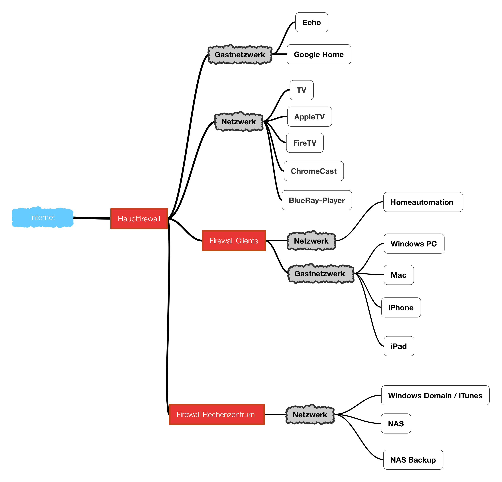

</img>
# CyberSecurity-Box<h3>(inkl. Pi-Hole, UnBound, ntopng and Tor)</h3>

<ul><li>
  <h3>Installation CyberSecurityBox</h3>
  You need a Raspberry Pi and a SD-Card with 8 GByte or more.
  Use a blank <b><a href="https://www.raspberrypi.org/downloads/raspbian/">Raspbian-SD-Card-Image</a></b> or 
  <b>CyberSecurityBox_2.img</b> is the Pi-Hole, UnBound and torrc with a ready-to-use Image.
   Install one of this with <b><a href="https://www.balena.io/etcher/">balenaEtcher</a></b> on a SD-Card.  Insert the SD-Card in the RasPi. And use SSH or Putty for Installation and type the following code.  
  <pre><code>ssh [ip-address of RasPi]</code></pre>
  User: <i><b>pi</b></i>
   
  Password: <i><b>raspberry</b></i>  
  Change the Password with  
  <pre><code>passwd
[newpassword]
[newpassword]</code></pre>
  Don´t forget to note the <i><b>newpassword</b></i>. 
   
  <pre><code>sudo su
apt-get update
apt-get upgrade -y</code></pre>
  <ol>
    <li>
<h4>Type for Installation</h4>
     <pre><code>apt-get install tor unbound privoxy ntopng postfix iptables-persistent
curl -sSL https://install.pi-hole.net | bash</code></pre>
     and follow the messages on the screen. 
    </li>
    <li>
    <h4>The <a href="https://github.com/CyberAndi/CyberSecurity-Box/raw/master/pi-hole-teleporter_CyberSecurity_Box_without_Porn.tar.gz">pi-hole-teleporter_CyberSecurity_Box_without_Porn.tar.gz</a></h4> inludes White- and Blacklist (Advertisement and Maleware)</li>
    <li>
    <h4>The <a href="https://github.com/CyberAndi/CyberSecurity-Box/raw/master/pi-hole-teleporter_CyberSecurity_Box_without_Porn.tar.gz">pi-hole-teleporter_CyberSecurity_Box_2018-12-20_.tar.gz</a></h4> inludes White- and Blacklist (Advertisement, Maleware, Tracking and Porn)</li>
    <li>
    <h4>The <a href="https://github.com/CyberAndi/CyberSecurity-Box/raw/master/regex.list">regex.list</a></h4> includes Blacklist (Advertisment, Maleware, Tracking and Porn) with over 40% blocking rate     
  <pre><code>service pihole-FTL stop
curl -sSL --compressed https://github.com/CyberAndi/CyberSecurity-Box/blob/Version2/regex.list > regex.list
curl -sSL --compressed https://github.com/CyberAndi/CyberSecurity-Box/blob/Version2/whitelist_Alexa_Google_Home_Smarthome.txt > whitelist.txt
curl -sSL --compressed https://github.com/CyberAndi/CyberSecurity-Box/blob/Version2/tor/torrc > torrc
curl -sSL --compressed https://github.com/CyberAndi/CyberSecurity-Box/blob/Version2/unbound/root.hints > root.hints
curl -sSL --compressed https://github.com/CyberAndi/CyberSecurity-Box/blob/Version2/unbound/unbound.conf > unbound.conf
curl -sSL --compressed https://github.com/CyberAndi/CyberSecurity-Box/blob/Version2/boxed-bg.jpg > boxed-bg.jpg
curl -sSL --compressed https://github.com/CyberAndi/CyberSecurity-Box/blob/Version2/boxed-bg.png > boxed-bg.png
curl -sSL --compressed https://github.com/CyberAndi/CyberSecurity-Box/blob/Version2/blockingpage.css > blockingpage.css
curl -sSL --compressed https://github.com/CyberAndi/CyberSecurity-Box/blob/Version2/AdminLTE.min.css > AdminLTE.min.css
curl -sSL --compressed https://github.com/CyberAndi/CyberSecurity-Box/blob/Version2/skin-blue.min.css > skin-blue.min.css
 
cp regex.list /etc/pihole/regex.list
cp whitelist.txt /etc/pihole/whitelist.txt
cp root.hints /etc/unbound/root.hints
cp unbound.conf /etc/unbound/unbound.conf
cp boxed-bg.jpg /var/www/html/admin/img/boxed-bg.jpg
cp *.css /var/www/html/admin/style/vendor/
cp blockingpage.css /var/www/html/pihole/
 
service pihole-FTL start</code></pre>
   </li>
  </ol>
  <li>
  <h3>(optional) Configuration of the AVM FRITZ!Box with Presets for Security and Port-List</h3>
<h4>This <a href="https://github.com/CyberAndi/CyberSecurity-Box/blob/master/CyberSecurityBox.zip">zip-File</a></h4> includes a AVM FRITZ!Box-Export-File for FRITZ OS 6.80 and above. It includes Firewall-Rules for Amazon Alexa/Echo, Google Assistens, NAS, MS-Servers etc. 
  </img>
  </li>
</ul>

For more Information in german visit https://www.cyberandi.de/Smarthome

Contact: <a href="mailto:cyberandi@outlook.de">cyberandi@outlook.de</a> - Website: https://www.cyberandi.de

